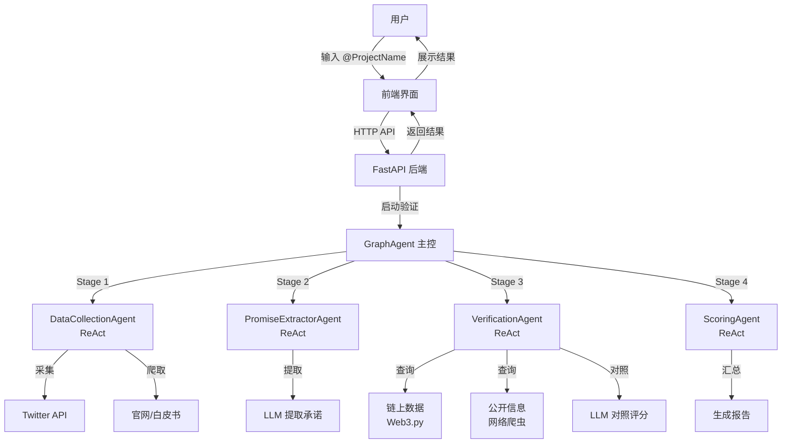
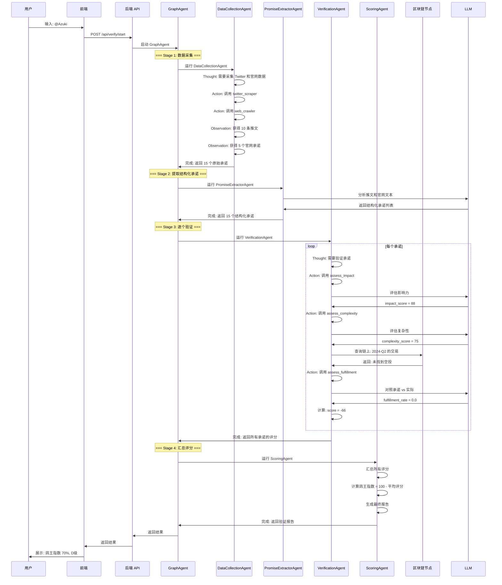
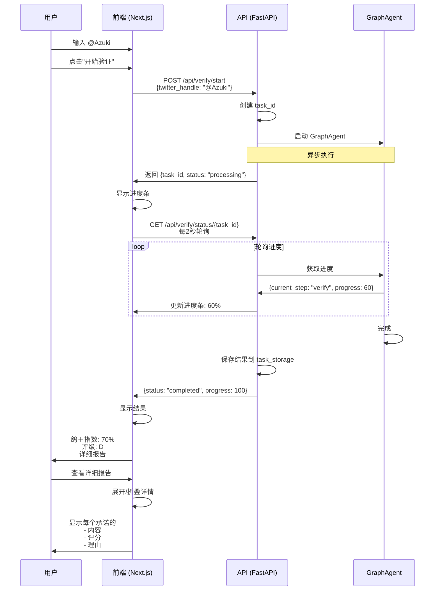
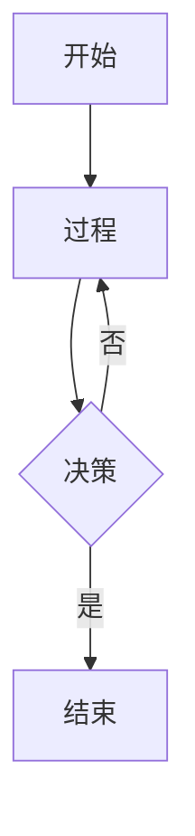

# 画饼识破 - 项目需求文档 v1.0

**项目名称**: 画饼识破 (Promise Breaker Detector)
**项目类型**: 基于 SpoonOS 的多 Agent 应用
**目标**: 自动化验证 NFT 项目的承诺履约情况
**文档版本**: v1.0
**创建日期**: 2025-01-28
**团队讨论**: 待审核

---

## 📋 目录

1. [项目概述](#项目概述)
2. [核心需求](#核心需求)
3. [技术架构](#技术架构)
4. [Agent 系统设计](#agent-系统设计)
5. [工具系统设计](#工具系统设计)
6. [数据流程图](#数据流程图)
7. [提示词设计](#提示词设计)
8. [技术栈](#技术栈)
9. [待讨论问题](#待讨论问题)
10. [实施计划](#实施计划)

---

## 1. 项目概述

### 1.1 问题陈述

NFT 项目经常在 Twitter、白皮书、官网中做出各种承诺，但实际履约情况参差不齐。目前缺乏一个自动化的系统来：

- 采集项目的公开承诺
- 验证承诺是否兑现
- 评估项目的"鸽王指数"

### 1.2 解决方案

基于 **SpoonOS Framework** 构建多 Agent 系统，自动化完成：

1. 采集项目的公开承诺（Twitter、官网、白皮书）
2. 对每个承诺查询链上实际行为
3. 对照承诺和实际行为，进行智能评分
4. 生成"鸽王指数"和履约报告

### 1.3 核心价值

- **透明度**: 揭示项目真实的履约情况
- **自动化**: AI Agent 自动完成整个验证流程
- **智能化**: LLM 驱动的评分机制
- **可解释**: 每个评分都有详细的推理过程

---

## 2. 核心需求

### 2.1 功能需求

| 优先级 | 功能 | 描述 |
|--------|------|------|
| P0 | 承诺采集 | 从 Twitter、官网采集项目承诺 |
| P0 | 链上验证 | 查询特定时间范围的链上行为 |
| P0 | 对照评分 | 对照承诺和实际行为，智能评分 |
| P1 | 报告生成 | 生成履约报告和鸽王指数 |
| P2 | 前端展示 | 可视化展示验证结果 |
| P2 | 历史记录 | 保存项目的验证历史 |

### 2.2 非功能需求

- **性能**: 单个项目验证时间 < 30秒
- **准确度**: 评分准确率 > 80%
- **可解释性**: 每个评分都有推理过程
- **可扩展性**: 支持添加新的验证类型

---

## 3. 技术架构

### 3.1 整体架构

采用 **Graph + ReAct 混合模式**：

```
GraphAgent (主控 - 定义流程)
  ├─ DataCollectionAgent (ReAct)
  ├─ PromiseExtractorAgent (ReAct)
  ├─ VerificationAgent (ReAct)
  └─ ScoringAgent (ReAct)
```

### 3.2 架构图



### 3.3 详细流程图



---

## 4. Agent 系统设计

### 4.1 Agent 列表

#### 4.1.1 GraphAgent (主控)

**类型**: `GraphAgent`
**职责**: 定义整体工作流程，协调各个 Agent 的执行顺序

```python
from spoon_ai import GraphAgent
from spoon_ai.graph import StateGraph

workflow = StateGraph()
workflow.add_node("collect", DataCollectionAgent())
workflow.add_node("extract", PromiseExtractorAgent())
workflow.add_node("verify", VerificationAgent())
workflow.add_node("score", ScoringAgent())

workflow.add_edge("collect", "extract")
workflow.add_edge("extract", "verify")
workflow.add_edge("verify", "score")

agent = GraphAgent(
    name="promise_verification_system",
    graph=workflow
)
```

---

#### 4.1.2 DataCollectionAgent (数据采集)

**类型**: `SpoonReactAI` (ReAct 模式)
**职责**: 采集项目的公开承诺数据

| 项目 | 内容 |
|------|------|
| **输入** | 项目 Twitter 账号 (@ProjectName) |
| **输出** | 原始承诺列表 (JSON) |
| **工具** | TwitterScraperTool, WebCrawlerTool |
| **Prompt** | 见下节 |

**工作流程**:
1. 接收 Twitter 账号
2. 调用 TwitterScraperTool 采集最近 10-20 条推文
3. 调用 WebCrawlerTool 爬取官网路线图
4. 过滤并合并承诺数据
5. 返回结构化承诺列表

---

#### 4.1.3 PromiseExtractorAgent (承诺提取)

**类型**: `SpoonReactAI` (ReAct 模式)
**职责**: 从非结构化文本中提取结构化承诺

| 项目 | 内容 |
|------|------|
| **输入** | 原始文本（推文、官网内容） |
| **输出** | 结构化承诺对象 |
| **工具** | PromiseExtractorTool (使用 LLM) |
| **Prompt** | 见下节 |

**工作流程**:
1. 接收原始承诺列表
2. 对每个文本段落，使用 LLM 提取：
   - 承诺内容
   - 时间线 (start_date, end_date)
   - 关键词
3. 标准化承诺格式
4. 返回结构化承诺对象

---

#### 4.1.4 VerificationAgent (验证对照) ⭐ 核心

**类型**: `SpoonReactAI` (ReAct 模式)
**职责**: 对每个承诺查询链上行为，对照并评分

| 项目 | 内容 |
|------|------|
| **输入** | 结构化承诺列表 |
| **输出** | 每个承诺的评分和验证结果 |
| **工具** | ImpactAssessmentTool, ComplexityAssessmentTool, OnChainQueryTool, FulfillmentAssessmentTool |
| **Prompt** | 见下节 |

**工作流程**:
1. 接收结构化承诺列表
2. 对每个承诺：
   - 评估影响力 (LLM)
   - 评估复杂性 (LLM)
   - 查询链上行为 (Web3.py)
   - 对照承诺和实际 (LLM)
   - 计算分数
3. 汇总所有评分
4. 返回验证结果列表

---

#### 4.1.5 ScoringAgent (评分汇总)

**类型**: `SpoonReactAI` (ReAct 模式)
**职责**: 汇总所有评分，计算鸽王指数

| 项目 | 内容 |
|------|------|
| **输入** | 每个承诺的评分 |
| **输出** | 最终报告（鸽王指数、评级、详细分析） |
| **工具** | AggregateScoresTool, CalculatePigeonIndexTool |
| **Prompt** | 见下节 |

**工作流程**:
1. 接收所有承诺的评分
2. 计算总分、平均分
3. 计算鸽王指数 = 100 - 平均分
4. 确定评级 (S/A/B/C/D)
5. 生成详细报告
6. 返回最终结果

---

### 4.2 Agent 总结表

| Agent | 类型 | 输入 | 输出 | 工具数量 | LLM 调用 |
|-------|------|------|------|----------|----------|
| GraphAgent | Graph | Twitter 账号 | 最终报告 | 0 | 0 |
| DataCollectionAgent | ReAct | Twitter 账号 | 原始承诺 | 2 | 0 |
| PromiseExtractorAgent | ReAct | 原始文本 | 结构化承诺 | 1 | ~10 |
| VerificationAgent | ReAct | 结构化承诺 | 评分列表 | 4 | ~30 |
| ScoringAgent | ReAct | 评分列表 | 最终报告 | 2 | 0 |

**总计**: 5 个 Agent，9 个工具，约 40 次 LLM 调用

---

## 5. 工具系统设计

### 5.1 工具列表

#### 5.1.1 数据采集工具

**TwitterScraperTool**
```python
class TwitterScraperTool(BaseTool):
    name: str = "twitter_scraper"
    description: str = "采集项目 Twitter 推文"

    parameters: {
        "twitter_handle": "项目 Twitter 账号",
        "count": "采集数量 (默认 20)"
    }

    async def execute(twitter_handle, count=20):
        # MVP: 模拟数据
        # 生产: Twitter API / 爬虫
        return tweets
```

**WebCrawlerTool**
```python
class WebCrawlerTool(BaseTool):
    name: str = "web_crawler"
    description: str = "爬取项目官网和白皮书"

    parameters: {
        "url": "网站 URL",
        "target": "目标 (roadmap/whitepaper/blog)"
    }

    async def execute(url, target="roadmap"):
        # MVP: 模拟数据
        # 生产: BeautifulSoup / Playwright
        return content
```

---

#### 5.1.2 承诺提取工具

**PromiseExtractorTool**
```python
class PromiseExtractorTool(BaseTool):
    name: str = "promise_extractor"
    description: str = "使用 LLM 从文本中提取承诺"

    parameters: {
        "text": "要分析的文本",
        "source": "文本来源 (twitter/website)"
    }

    llm: ChatBot = Field(default_factory=ChatBot)

    async def execute(text, source):
        prompt = f"""
        从以下文本中提取承诺信息：
        {text}

        请提取：
        1. 承诺内容
        2. 时间线 (start_date, end_date, quarter)
        3. 承诺类型关键词

        返回 JSON 格式。
        """

        result = await self.llm.achat(prompt)
        return parse_result(result)
```

---

#### 5.1.3 验证评分工具 ⭐ 核心

**ImpactAssessmentTool**
```python
class ImpactAssessmentTool(BaseTool):
    name: str = "assess_impact"
    description: str = "评估承诺对 holder 的影响力 (0-100分)"

    parameters: {
        "promise": "承诺内容",
        "context": "项目背景 (holder 数量、代币价格等)"
    }

    async def execute(promise, context):
        # 使用 LLM 评估影响力
        # 评估维度：经济、功能、品牌、体验
        pass
```

**ComplexityAssessmentTool**
```python
class ComplexityAssessmentTool(BaseTool):
    name: str = "assess_complexity"
    description: str = "评估承诺的实现复杂性 (0-100分)"

    parameters: {
        "promise": "承诺内容"
    }

    async def execute(promise):
        # 使用 LLM 评估复杂性
        # 评估维度：技术、资源、时间、依赖
        pass
```

**OnChainQueryTool**
```python
class OnChainQueryTool(BaseTool):
    name: str = "onchain_query"
    description: str = "查询特定时间范围的链上行为"

    parameters: {
        "contract_address": "合约地址",
        "start_date": "承诺开始时间 (YYYY-MM-DD)",
        "end_date": "承诺结束时间 (YYYY-MM-DD)",
        "query_type": "查询类型 (token_deploy/airdrop/contract_call/transfer)"
    }

    async def execute(contract_address, start_date, end_date, query_type):
        # MVP: 模拟链上查询
        # 生产: Web3.py + Etherscan API
        pass
```

**FulfillmentAssessmentTool**
```python
class FulfillmentAssessmentTool(BaseTool):
    name: str = "assess_fulfillment"
    description: str = "对照承诺和实际行为，评估兑现程度 (0.0-1.0)"

    parameters: {
        "promise": "承诺对象",
        "onchain_evidence": "链上证据"
    }

    async def execute(promise, onchain_evidence):
        # 使用 LLM 对照承诺和实际
        # 评估兑现程度：完全/大部分/部分/小部分/未
        pass
```

---

#### 5.1.4 评分工具

**AggregateScoresTool**
```python
class AggregateScoresTool(BaseTool):
    name: str = "aggregate_scores"
    description: str = "汇总所有承诺的评分"

    parameters: {
        "scores": "评分列表"
    }

    async def execute(scores):
        # 计算总分、平均分
        pass
```

**CalculatePigeonIndexTool**
```python
class CalculatePigeonIndexTool(BaseTool):
    name: str = "calculate_pigeon_index"
    description: str = "计算鸽王指数"

    parameters: {
        "total_score": "总评分",
        "promise_count": "承诺数量"
    }

    async def execute(total_score, promise_count):
        # 计算鸽王指数
        pigeon_index = 100 - (total_score / promise_count)

        # 确定评级
        if pigeon_index <= 10: rating = "S"
        elif pigeon_index <= 30: rating = "A"
        elif pigeon_index <= 50: rating = "B"
        elif pigeon_index <= 70: rating = "C"
        else: rating = "D"

        return {
            "pigeon_index": pigeon_index,
            "rating": rating
        }
```

---

### 5.2 工具总结表

| 工具 | Agent | 类型 | LLM | 复杂度 |
|------|-------|------|-----|--------|
| TwitterScraperTool | DataCollection | 数据采集 | ❌ | 低 |
| WebCrawlerTool | DataCollection | 数据采集 | ❌ | 低 |
| PromiseExtractorTool | PromiseExtractor | 数据提取 | ✅ | 中 |
| ImpactAssessmentTool | Verification | 评估 | ✅ | 中 |
| ComplexityAssessmentTool | Verification | 评估 | ✅ | 中 |
| OnChainQueryTool | Verification | 查询 | ❌ | 高 |
| FulfillmentAssessmentTool | Verification | 对照 | ✅ | 高 |
| AggregateScoresTool | Scoring | 计算 | ❌ | 低 |
| CalculatePigeonIndexTool | Scoring | 计算 | ❌ | 低 |

---

## 6. 数据流程图

### 6.1 完整系统流程

```mermaid
graph LR
    User[用户] --> Frontend[前端界面<br/>Next.js]

    Frontend -->|HTTP POST<br/>'verify'| API[FastAPI<br/>后端]

    API --> GraphAgent[GraphAgent<br/>主控]

    GraphAgent --> Collector[DataCollectionAgent<br/>ReAct]
    Collector --> Twitter[Twitter API]
    Collector --> Web[Web Crawler<br/>官网]

    GraphAgent --> Extractor[PromiseExtractorAgent<br/>ReAct]
    Extractor --> LLM1[LLM<br/>提取承诺]

    GraphAgent --> Verifier[VerificationAgent<br/>ReAct]
    Verifier --> Impact[LLM<br/>评估影响]
    Verifier --> Complexity[LLM<br/>评估复杂]
    Verifier --> Blockchain[Web3.py<br/>链上查询]
    Verifier --> Fulfillment[LLM<br/>对照评估]

    GraphAgent --> Scorer[ScoringAgent<br/>ReAct]
    Scorer --> Report[生成报告]

    API --> Database[(可选)<br/>数据库]

    API --> Frontend
    Frontend --> Display[展示结果<br/>鸽王指数]

    Display --> User
```

### 6.2 链上数据交互流程

```mermaid
sequenceDiagram
    participant VA as VerificationAgent
    participant OQ as OnChainQueryTool
    participant W3 as Web3.py
    participant Node as 以太坊节点
    participant Etherscan as Etherscan API

    VA->>VA: Thought: 需要验证承诺 "Q2 空投"
    VA->>VA: Action: onchain_query

    VA->>OQ: execute(
        contract='0x123...',
        start='2024-04-01',
        end='2024-06-30',
        type='airdrop'
    )

    OQ->>W3: query_contract_events(
        contract='0x123...',
        from_block=12345,
        to_block=12999
    )

    W3->>Node: JSON-RPC Request
    Node->>W3: 返回区块数据

    alt 未找到数据
        W3->>Etherscan: 查询交易历史
        Etherscan->>W3: 返回 []
    end

    W3->>OQ: {found: false, transactions: []}
    OQ->>VA: Observation: 未找到空投

    VA->>VA: Thought: 承诺未兑现
    VA->>VA: Action: assess_fulfillment

    VA->>LLM: 对照: 承诺 Q2 空投 vs 实际 未找到
    LLM->>VA: fulfillment_rate = 0.0
    VA->>VA: score = -66
```

### 6.3 前端交互流程



---

## 7. 提示词设计

### 7.1 DataCollectionAgent Prompt

```python
SYSTEM_PROMPT = """
你是数据采集专家，负责收集 NFT 项目的公开承诺。

**你的任务**：
1. 从 Twitter 采集项目最近 10-20 条推文
2. 从官网爬取路线图和白皮书内容
3. 过滤出包含承诺关键词的内容
4. 合并去重

**承诺关键词**：
- "launch"（发布）
- "drop"（推出）
- "airdrop"（空投）
- "staking"（质押）
- "Q1/Q2/Q3/Q4"（时间）
- "2024/2025"（年份）
- "coming soon"（即将推出）
- "promise"（承诺）
- "roadmap"（路线图）

**输出格式**：
{
    "source": "twitter" | "website",
    "content": "原始文本",
    "url": "链接",
    "timestamp": "时间戳"
}
"""

NEXT_STEP_PROMPT = """
你有以下工具可用：
{tool_list}

采集流程：
1. 先用 twitter_scraper 采集推文
2. 再用 web_crawler 爬取官网
3. 过滤并合并结果

注意：
- 只采集公开信息，不要访问私人数据
- 如果采集失败，记录错误并继续
- 最终返回 10-30 条承诺相关内容
"""
```

---

### 7.2 PromiseExtractorAgent Prompt

```python
SYSTEM_PROMPT = """
你是承诺提取专家，负责从非结构化文本中提取结构化承诺。

**你的任务**：
1. 分析文本，识别是否包含承诺
2. 提取承诺的核心内容
3. 识别承诺的时间线
4. 识别承诺的类型关键词

**提取字段**：
- content: 承诺的核心内容
- timeline: {
    mentioned: 是否有时间
    start_date: 开始时间 (YYYY-MM-DD)
    end_date: 结束时间
    quarter: 季度 (Q1/Q2/Q3/Q4)
    year: 年份
  }
- keywords: ["airdrop", "token", "staking", ...]

**输出格式**：
{
    "id": "promise_1",
    "content": "Q2 2024 空投代币给所有 holder",
    "timeline": {
        "mentioned": true,
        "end_date": "2024-06-30",
        "quarter": "Q2 2024"
    },
    "keywords": ["airdrop", "token", "holder"],
    "confidence": 0.9
}
"""

NEXT_STEP_PROMPT = """
你有以下工具可用：
{tool_list}

提取流程：
1. 对每段文本，调用 promise_extractor
2. LLM 会自动识别承诺并提取结构化信息
3. 累积所有承诺，去重

注意：
- 只提取明确的承诺，模糊的不要
- 时间线要准确，无法确定的标记为 null
- 关键词要全面，帮助后续分类
"""
```

---

### 7.3 VerificationAgent Prompt ⭐

```python
SYSTEM_PROMPT = """
你是承诺验证专家，负责对照承诺和链上实际行为。

**你的核心任务**：
对每个承诺，你必须：
1. 评估承诺的影响力 (0-100分)
2. 评估承诺的复杂性 (0-100分)
3. 查询承诺时间范围的链上行为
4. 对照承诺和实际行为
5. 计算分数

**评分公式**：
```
score = impact_score × (complexity_score / 100) × fulfillment_rate

如果完全未兑现 (fulfillment_rate < 0.3):
    score = -impact_score × (complexity_score / 100) × 1.5  # 惩罚
```

**评估标准**：

1. **影响力评分 (0-100)**：
   - 经济影响 (30分): 涉及金钱/收益吗？影响范围多大？
   - 功能影响 (30分): 核心功能还是次要功能？
   - 品牌影响 (20分): 提升市场信心吗？
   - 体验影响 (20分): 改善用户体验吗？

2. **复杂性评分 (0-100)**：
   - 技术难度 (40分): 需要新技术吗？开发量多大？
   - 资源需求 (30分): 需要多少资金和人力？
   - 时间压力 (20分): 时间范围合理吗？
   - 依赖性 (10分): 依赖外部因素吗？

3. **兑现程度 (0.0-1.0)**：
   - 1.0 = 完全兑现（按时、保质、保量）
   - 0.7-0.9 = 大部分兑现（轻微延迟、基本达标）
   - 0.3-0.7 = 部分兑现（延迟明显、质量/数量不足）
   - 0.1-0.3 = 小部分兑现（严重延迟、严重不足）
   - 0.0 = 未兑现（完全没做）

**关键原则**：
- 链上证据（合约、交易）权重最高
- 官方公告次之
- 社区传闻权重最低
- 必须查询链上实际行为，不能只凭承诺判断
"""

NEXT_STEP_PROMPT = """
你有以下工具可用：
{tool_list}

验证流程（每个承诺）：
1. assess_impact: 评估影响力 (LLM)
2. assess_complexity: 评估复杂性 (LLM)
3. onchain_query: 查询链上行为 ⭐ 必选
4. assess_fulfillment: 对照承诺和实际 (LLM)

重要：
- 必须对每个承诺都查询链上行为
- 不能只看项目方说了什么，要看做了什么
- 技术类承诺没有链上证据 = 未兑现
- 运营类承诺可以查公开信息

示例：
承诺: "Q2 空投"
→ 查询链上: 2024-04-01 到 2024-06-30 的空投交易
→ 如果找到: 兑现
→ 如果没找到: 未兑现
"""
```

---

### 7.4 ScoringAgent Prompt

```python
SYSTEM_PROMPT = """
你是评分汇总专家，负责计算最终的鸽王指数。

**你的任务**：
1. 汇总所有承诺的评分
2. 计算平均分
3. 计算鸽王指数
4. 确定评级等级
5. 生成可读报告

**鸽王指数定义**：
```
鸽王指数 = 100 - 平均评分

- 鸽王指数 0-10: S 级 (按时交付王)
- 鸽王指数 11-30: A 级 (说到做到)
- 鸽王指数 31-50: B 级 (基本靠谱)
- 鸽王指数 51-70: C 级 (雷声大雨点小)
- 鸽王指数 71-100: D 级 (画饼艺术家)
```

**输出格式**：
{
    "project": "@Azuki",
    "total_promises": 15,
    "fulfilled_promises": 5,
    "average_score": 30,
    "pigeon_index": 70,
    "rating": "D",
    "summary": "该项目承诺多但兑现少，严重的鸽王",
    "promises_breakdown": [...]
}
"""

NEXT_STEP_PROMPT = """
你有以下工具可用：
{tool_list}

汇总流程：
1. aggregate_scores: 汇总所有评分
2. calculate_pigeon_index: 计算鸽王指数

注意：
- 平均分可以是负数（如果大部分承诺未兑现）
- 鸽王指数永远在 0-100 之间
- 如果鸽王指数 > 70，在报告中强调这是严重的鸽王
"""
```

---

## 8. 技术栈

### 8.1 后端

| 组件 | 技术 | 版本 |
|------|------|------|
| **Agent 框架** | SpoonOS | 0.3.6 |
| **Web 框架** | FastAPI | 0.104+ |
| **异步运行** | uvicorn | 0.24+ |
| **LLM** | OpenAI GPT-4o / Anthropic Claude | - |
| **区块链** | Web3.py | 6.11+ |
| **爬虫** | BeautifulSoup, Playwright | - |
| **Python** | Python | 3.13+ |

### 8.2 前端

| 组件 | 技术 | 版本 |
|------|------|------|
| **框架** | Next.js | 15.1+ |
| **语言** | TypeScript | 5.3+ |
| **样式** | Tailwind CSS | - |
| **状态管理** | React Hooks | - |
| **HTTP** | fetch / axios | - |

### 8.3 数据存储 (可选)

| 组件 | 技术 | 用途 |
|------|------|------|
| **缓存** | Redis | 缓存验证结果 |
| **数据库** | SQLite / PostgreSQL | 存储历史记录 |

---

## 9. 待讨论问题

### 问题 1: 打分机制的复杂度

**当前方案 (A)**：完整版，3 个 LLM 评估
- 评估影响力 (LLM)
- 评估复杂性 (LLM)
- 评估兑现程度 (LLM)

**简化方案 (B)**：只评估影响力和兑现
- 评估影响力 (LLM)
- 评估兑现程度 (LLM)
- 去掉复杂性

**最简方案 (C)**：只有综合评估
- 综合评估 (LLM 一次性判断)

**讨论点**：
- 需要多精确的评分？(A)
- 还是够用即可？(B/C)
- LLM 调用成本可以接受吗？

---

### 问题 2: 时间因素

**场景**：承诺"Q2 发币"，实际 Q3 才发

**选项 A**: 时间因素很重要
```
按时兑现: +20分
延迟1季度: +10分
延迟2季度: +5分
延迟>2季度: 0分
```

**选项 B**: 只看兑现，不看时间
```
兑现了: +20分
没兑现: 0分
```

**讨论点**：
- 延迟兑现需要惩罚吗？
- 惩罚的权重多大？
- 如何平衡"做总比不做好"？

---

### 问题 3: 部分兑现

**场景**：承诺"空投 10,000 代币"，实际 5,000

**选项 A**: 线性打分
```
完全兑现: 20分
50%兑现: 10分 (20 × 0.5)
30%兑现: 6分 (20 × 0.3)
```

**选项 B**: 非线性打分
```
>80%兑现: 满分
50-80%兑现: 80%分
30-50%兑现: 50%分
<30%兑现: 20%分
```

**选项 C**: LLM 判断
```
让 LLM 根据实际情况主观判断
```

**讨论点**：
- 如何评估部分兑现的质量？
- 范围不符怎么办？（承诺"所有 holder"，实际只给前 100 个）

---

### 问题 4: 证据置信度

**当前设计**：不同证据类型有不同权重
```
链上证据: 权重 1.0 (100%可信)
官方公告: 权重 0.9 (90%可信)
媒体报道: 权重 0.8 (80%可信)
社区反馈: 权重 0.5 (50%可信)
```

**讨论点**：
- 是否需要区分证据类型？
- 社区反馈的可信度太低，是否应该排除？
- 如何处理相互矛盾的证据？

---

### 问题 5: 链上数据来源

**选项 A**: Etherscan API
- 优点：数据全、免费额度
- 缺点：有速率限制

**选项 B**: Web3.py 直接连接节点
- 优点：无限制
- 缺点：需要自己运行节点

**选项 C**: Data Dance SDK
- 优点：专门服务
- 缺点：可能需要付费

**讨论点**：
- 使用哪个数据源？
- 如何处理速率限制？
- 是否需要多数据源备份？

---

### 问题 6: MVP 范围

**当前设计**：
- 4 个 Agent (Graph 模式)
- 9 个工具
- 5 个 LLM 提示词
- 完整的链上验证

**MVP 简化方案**：
- 1 个 Agent (ReAct 模式)
- 3 个工具 (Twitter、Web、评分)
- 2 个 LLM 提示词
- 模拟链上数据

**讨论点**：
- 先做 MVP 验证想法？
- 还是直接做完整版？
- 哪些功能可以后期迭代？

---

### 问题 7: 前端优先级

**选项 A**: 前端和后端同步开发
- 优点：整体进度快
- 缺点：需要更多人力

**选项 B**: 先后端 CLI，再加前端
- 优点：专注核心逻辑
- 缺点：Demo 效果较差

**选项 C**: 先前端 mock，再接后端
- 优点：Demo 效果好
- 缺点：需要后期集成

**讨论点**：
- 黑客松时间有多长？
- 团队规模和分工？
- Demo 时最重要的展示什么？

---

### 问题 8: LLM 选择

**选项 A**: OpenAI GPT-4o
- 优点：性能强、工具调用好
- 缺点：成本较高

**选项 B**: Anthropic Claude 3.5 Sonnet
- 优点：性价比高、长文本好
- 缺点：工具调用稍弱

**选项 C**: 混合使用
- 评估用小模型 (GPT-4o-mini)
- 验证用大模型 (GPT-4o)

**讨论点**：
- 预算有限？
- 哪些任务需要更强性能？
- API Key 配置方便吗？


---

## 附录

### A. Mermaid 图例说明



### B. 术语表

| 术语 | 解释 |
|------|------|
| **Agent** | 智能 Agent，使用 LLM 和工具完成特定任务 |
| **ReAct** | Reasoning + Acting，LLM 推理并调用工具 |
| **Graph** | 状态图，定义多个 Agent 的执行流程 |
| **SpoonOS** | AI Agent 框架，提供 ReAct 和 Graph Agent |
| **鸽王指数** | 项目未兑现承诺的百分比，越高越差 |
| **链上验证** | 查询区块链上的实际交易和合约状态 |
| **兑现程度** | 承诺实际完成的程度 (0.0-1.0) |

---

## 文档状态

**版本**: v1.0
**状态**: 待团队讨论
**下一步**: 根据讨论结果更新文档

---

**讨论清单**：
- [ ] 打分机制选择 (A/B/C)
- [ ] 是否考虑时间因素
- [ ] 如何处理部分兑现
- [ ] 证据置信度是否需要
- [ ] 链上数据来源选择
- [ ] MVP 范围确定
- [ ] 前端优先级
- [ ] LLM 选择

**请大家在讨论时标记决策，我会根据结果更新架构！** 🚀
